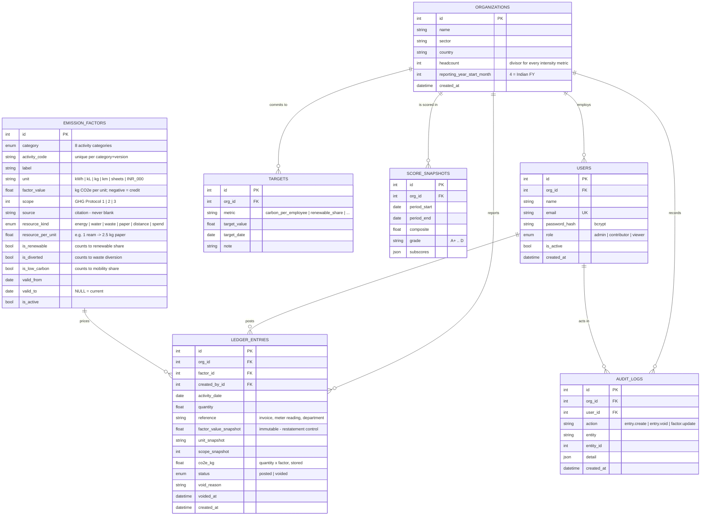

# Entity-Relationship Diagram

## Relationship notes

| Relationship | Cardinality | Why |
|---|---|---|
| Organization → Users | 1 : N | multi-tenant; one login belongs to exactly one organisation |
| Organization → Ledger entries | 1 : N | every posting belongs to one reporting entity |
| Emission factor → Ledger entries | 1 : N | one factor prices many postings |
| User → Ledger entries | 1 : N | attribution — who posted it |

## Normalisation

The schema is in **3NF**:

* **1NF** — every column is atomic; no repeating groups (a month's entries are
  N rows, not a column per day).
* **2NF** — no partial dependency; every table has a single-column surrogate
  key, and all attributes depend on that whole key.
* **3NF** — no transitive dependency. A factor's `label`, `unit` and `source`
  live in `emission_factors`, not repeated on every entry that uses it.

**The one deliberate denormalisation**: `ledger_entries` duplicates
`factor_value`, `unit` and `scope` from `emission_factors` as `*_snapshot`
columns. This is not redundancy by accident — it is a *temporal* requirement.
A factor is a value that changes over time; an entry must keep the value that
was in force when it was posted, or every historical report silently changes
the next time a factor is revised. `co2e_kg` is stored for the same reason and
for query speed: aggregating a stored column is far cheaper than recomputing a
join-and-multiply across a hundred thousand rows on every dashboard load.

## Indexes

| Index | Columns | Serves |
|---|---|---|
| `ix_entry_org_date` | `org_id, activity_date` | every dashboard query (period filter) |
| `ix_entry_org_status` | `org_id, status` | excluding voided entries from totals |
| `ix_factor_lookup` | `category, is_active` | the activity picker on the Log screen |
| `uq_users_email` | `email` | login, and enforcing one account per address |
| `uq_factor_version` | `category, activity_code, valid_from` | prevents two live versions of the same factor |
